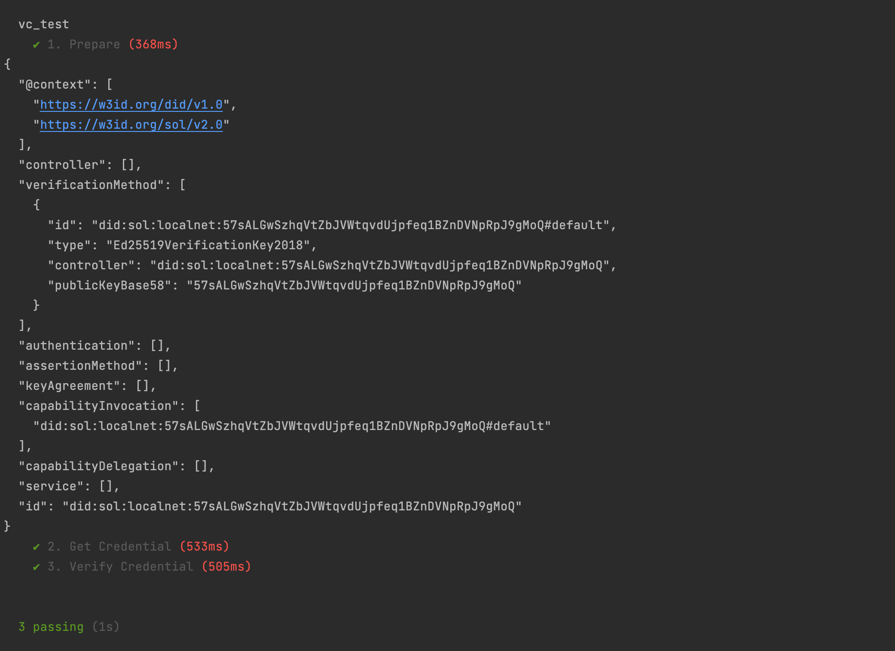
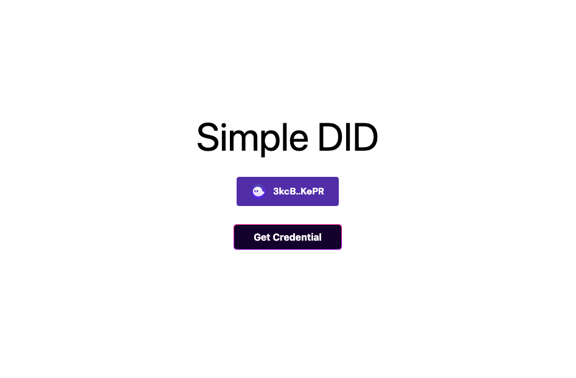
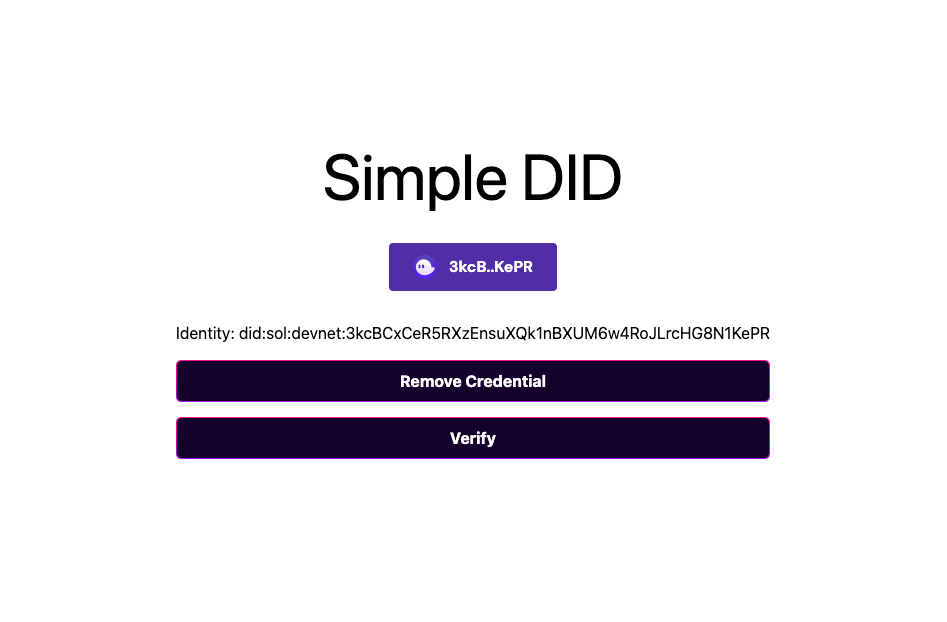

# solana_did
Simple DID Verification (Solana program and app) 

# Features
- Create a DID credential from Solana wallet
- Verify DID credential by Solana program

# Usage

## 1. Solana program

### Build

```shell
$ anchor build
```

### Unit tests

- Install the dependencies
```shell
$ yarn install
```

- Set the wallet

Set your wallet in `./Anchor.toml` file

```shell
[provider]
cluster = "localnet"
wallet = "/Users/suni/.config/solana/id.json"
```

- Run unit tests
```shell
$ yarn test
```



## 2. App

### Require

Node version >= 16

### Install

```shell
$ cd app
$ yarn install
```

### Build

```shell
$ yarn build
```

### Run

```shell
$ yarn start
```

# Result
- Get credential


- Verify/Remove credential


# Enhancement

- Default DID credential structure

This is the default credential structure that is generated by SolDid program.
```
{
  "@context": [
    "https://w3id.org/did/v1.0",
    "https://w3id.org/sol/v2.0"
  ],
  "controller": [],
  "verificationMethod": [
    {
      "id": "did:sol:devnet:3kcBCxCeR5RXzEnsuXQk1nBXUM6w4RoJLrcHG8N1KePR#default",
      "type": "Ed25519VerificationKey2018",
      "controller": "did:sol:localnet:3kcBCxCeR5RXzEnsuXQk1nBXUM6w4RoJLrcHG8N1KePR",
      "publicKeyBase58": "3kcBCxCeR5RXzEnsuXQk1nBXUM6w4RoJLrcHG8N1KePR"
    }
  ],
  "authentication": [],
  "assertionMethod": [],
  "keyAgreement": [],
  "capabilityInvocation": [
    "did:sol:devnet:3kcBCxCeR5RXzEnsuXQk1nBXUM6w4RoJLrcHG8N1KePR#default"
  ],
  "capabilityDelegation": [],
  "service": [],
  "id": "did:sol:devnet:3kcBCxCeR5RXzEnsuXQk1nBXUM6w4RoJLrcHG8N1KePR"
}
```

- Enhancement  

We can add/remove service or verificationMethod in this credential.
And this credential is public with id.

